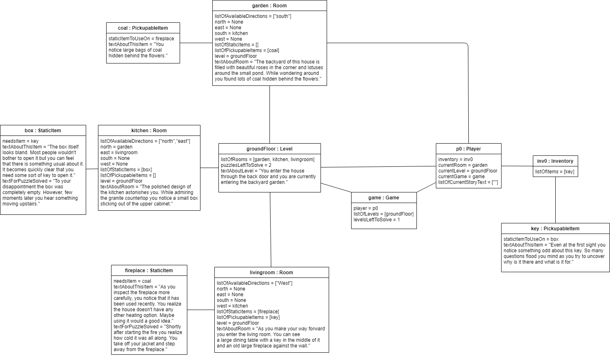

# Assignment 2

Maximum number of words for this document: 12000

**IMPORTANT**: In this assignment you will model the whole system. Within each of your models, you will have a *prescriptive intent* when representing the elements related to the feature you are implementing in this assignment, whereas the rest of the elements are used with a *descriptive intent*. In all your diagrams it is strongly suggested to used different colors for the prescriptive and descriptive parts of your models (this helps you in better reasoning on the level of detail needed in each part of the models and the instructors in knowing how to assess your models).   

**Format**: establish formatting conventions when describing your models in this document. For example, you style the name of each class in bold, whereas the attributes, operations, and associations as underlined text, objects are in italic, etc.
> IN THIS DOCUMENT
>todo: Each class in this document in bold.
>todo: Each attribution, association, operation, with underline.
>todo: Objects (instances)  in italic.

### Implemented feature

| ID  | Short name  | Description  |
|---|---|---|
| F1  | move | Moving player through rooms. |
| F2  | pick up item | Picking up pickupable items in rooms, and placing them in inventory. |
| F3  | "actioning" item | Performing some action on a static item in a room. This completes a puzzle. |
| F4  | use item on item | Use a picked up item in inventory, on a static item in the room. This completes a puzzle.  |
| F5  | inventory | Picked up items are deleted from the room, and added to the inventory. |
| F6  | input validation | User can write any input. Trigger words are directions, names of static items and pickupable items. With the right combination of trigger words, the system processes changes for player's attributes, and updates puzzles solved. |

### Used modeling tool
[draw.io](https://www.draw.io)

## Class diagram									
Author: Ece Doganer

This chapter contains the specification of the UML class diagram of your system, together with a textual description of all its elements.

`Figure representing the UML class diagram`

For each class (and data type) in the class diagram you have to provide a paragraph providing the following information:
- Brief description about what it represents
- Brief description of the meaning of each attribute
- Brief description of the meaning of each operation
- Brief description of the meaning of each association involving it (each association can be described only once in this deliverable)

Also, you can briefly discuss fragments of previous versions of the class diagram (with figures) in order to show how you evolved from initial versions of the class diagram to the final one.

In this document you have to adhere to the following formatting conventions:
- the name of each **class** is in bold
- the *attributes*, *operations*, *associations*, and *objects* are in italic.

Maximum number of words for this section: 3000

## Object diagrams								
Author: Mateusz Belka

    

  
The object diagram seen here presents the structure of a specific state of our system through the lens of UML. The aim of this diagram is, as opposed to class diagram, to allow the reader to understand the functional purpose of all classes quickly as well as to see the relationships between classes play out in action. The initial idea behind the structure of relationships between our classes was to maintain a tree-like structure in which the flow of information usually would go through some mediator instead of directly accessing the data from the desired class. Of course, such an approach has limitations as it's at times very troublesome to maintain such structure. Hence, our diagram aims to maintain such structure; however, it someone deviates from it.  

One shall start examining the diagram by noticing the instance of the game class. The purpose of its existence is to be a container for maintaining information about levels and player. It also allows information flow between those two sides of our tree structure. From the information flow point of view, the instance of the **player** class is the crucial point of the diagram. As we chose **player** class to be responsible for the majority of player-related activities, hence most events overall, most of the method calls either start or end in that class. As a result of our approach, the instance of **player** class also has the most direct accesses to instances of other classes to ease the need to talk to them continually. The instance of the **player** class is most notably connected to its inventories instance, and that object is connected to all of the items currently in it. On the left side from the instance of the **game** class, we can see the entire structure of areas player can reside in as well as the structures that support the existence of those areas. As standard game vocabulary etiquette suggests, we firstly split location into levels, which there can be multiple instances of, however, they are independent, and a player can only have access to one at a time. Each level can be connected to numerous instances of room. Those object of **room** class represents a singular, specific location a player can reside in. Rooms can have a multitude of items, both static items and pickupable items, connected to them or they can have no items. Pickupable items have a unique one-to-one connection with static items which can be seen in the instances of both of those classes on the diagram.

>total words: 439/1000

## State machine diagrams									
Author(s): Valeriya Komarnitskaya and Taylor Doughty 

[ Events and states from the moment a player enters the starting screen until loading the game world.](https://github.com/Ece-Doganer/Software-Design/blob/Assignment2/docs/visual/State%20Machine%20Diagram_final.jpg)
 Class Game.
 
State machine diagram represents states and events that are happening from the moment a player enters the starting screen until the actual start of the game. The decision to implement this part of the process in the diagram was made because, in our opinion, it is crucial to show what happens as a very first thing when the player enters the game and through which states do the game go through to load the game. The state machine diagram consists of 3 parts: the error-free part with input “start new game” or “continue”, the part with error handling and the part with different input than “start new game” or “continue”.

The part without an error is a composite state “Player starts the game” that contains in itself states and events from the moment a player enters the starting screen of the game until a player will load the game world. The game starts from the event when a player enters the starting screen. Then, the terminal is loading a welcoming text that allows a user to understand which options does he/she have before starting the game. The terminal is waiting for the input. The possible options are “start new game”, “continue”, “help”, “quit”. Depending on what user type, the program will analyse the input and do one of the following actions: to start a new game and load the game from the beginning, to continue previously started game, to get some help with the environment and possible inputs or quit the game. In case a user typed something different, the terminal will output a message indicating invalid input and will be waiting for new input. This part will be described in detail later. For now, since we are interested in what is happening when a player chooses to start the game or continue previously started, we proceed to the option when a user is typing “start new game”/”continue”. A quick state in terms of duration is the “load the game”. It is necessary due to the transition between events when a user is typing “start new game”/”continue” and actually starting to load the game. The final state in this composite state is “Start of the game” because this is the final point in loading the game, the moment when a user sees the description of the game, level, room and other story-related information. 

The part that is responsible for error handling is happening when loading the game was unsuccessful in the composite state. In other words, when the game did not load, the terminal outputs an error message and is waiting for new input. It is needed in order to be able to try loading the game by asking the user again to input a command. 

There are currently four possible inputs: “new game”, “continue”, “help”, “exit”. A new game we have already discussed. If a user types something else than “new game”/”continue”, there are three possible outcomes. In order to determine which one is the best for the user’s input, the check has to be completed. If the user has typed “help”, then new information about possible commands and environment will appear and the console will be ready for input again. If a player typed “exit”, then the console will stop waiting for the input and will exit to the desktop. If a user has typed none of these, then a user will receive a message stating that the input is invalid. A terminal will be waiting for new input. In this state machine diagram, in order to implement this check, we decided to use synchronization in order to have multiple options for an input and guards that would actually check the input and proceed to the next step depending on the input. 
>total words: 624

 ####Taylor's Diagram: 
 

Maximum number of words for this section: 3000

## Sequence diagrams									
Authors(in sequence): Ece Doganer, Valeriya Komarnitskaya

####User Input Validation

[User Input Validation Diagram](https://github.com/Ece-Doganer/Software-Design/blob/Assignment2/UserInputValidation.jpg)

>Prefix: Main object will already have saved a Player Object, in a variable called player. This will happen in the initialisation phase, which will not be covered now. On to the explanation.

Main object will receive a sentence of string input from user. This input will be sent to object inputValidator for validation. The sequence is as follows:
Inputvalidator will parse the input sentence into words. On these words, a number of functions will be issued. The functions are as follows:
1. First, a word is checked if it is a valid direction. To do this, inputValidator retrieves listOfAvailableDirections from the current room attribute of player. For each direction in this list, inputValidator checks if it equals the word. If so, inputValidator will increase its attribute totalDirectionsInInput, and add the word to its attribute list listOfValidInputtedWords.
2. Second, a word is checked if it is a valid static item. To do this, inputValidator retrieves listOfStaticItems from the current room attribute of player. For each static item in this list, inputValidator checks if it equals the word. If so, inputValidator will increase its attribute totalStaticItemsInInput, and add the word to its attribute list listOfValidInputtedWords.
3. Third, a word is checked if it is a valid pickup-able item. To do this, inputValidator retrieves listOfPickupableItems from the current room attribute of the player. 
A word is also a valid pickup-able item if it exists in player's inventory. Thus, inputValidator also retrieves listOfPickupableItems from player's inventory attribute. 
For each pickup-able item in both of these lists, inputValidator checks if it equals the word. If so, inputValidator will increase its attribute totalPickupableItemsInInput, and add the word to its attribute list listOfValidInputtedWords.

This concludes all functions that check words.

After having checked words, inputValidator checks the combination of the total of valid types of words in a sentence. Explanation is as follows:  
1. If totalDirectionsInInput is 1, and both totalStaticItemsInInput and totalPickupableItemsInInput are 0, then inputValidator's attribute typeOfInput is issued to be 1.
2. If both totalDirectionsInInput and totalStaticItemsInInput are 0, and totalPickupableItemsInInput is 1, then inputValidator's attribute typeOfInput is issued to be 2.
3. If totalDirectionsInInput is 0, totalStaticItemsInInput is 1, and totalPickupableItemsInInput is 0, then inputValidator's attribute typeOfInput is issued to be 3.
4. If totalDirectionsInInput is 0, and both totalStaticItemsInInput and totalPickupableItemsInInput are 1, then inputValidator's attribute typeOfInput is issued to be 4.
5. If there are any other value combinations for totalDirectionsInInput, totalStaticItemsInInput and totalPickupableItemsInInput, then inputValidator's attribute typeOfInput is issued to be 0.  

This concludes validation of the type of the input, which has been validated through looking at the combination of the valid words.

After finding out the value of inputValidator's attribute typeOfInput (and with it, the input sentence's validity), we call the method passInput in inputValidator. This method issues an ensuing method to the player object, depending on the value of typeOfInput. The explanation is as follows:
1. If typeOfInput is 1, movePlayer method is called in the object Player, passing the first and only element in the listOfValidInputtedWords.
2. If typeOfInput is 2, pickUpPickupableItem method is called in the object Player, passing the first and only element in the listOfValidInputtedWords.
3. If typeOfInput is 3, actionStaticItem method is called in the object Player, passing the first and only element in the listOfValidInputtedWords.
4. If typeOfInput is 4, inputValidator first issues a small method, named orderInput. This method checks if the first element of listOfValidInputtedWords is a static item. If so, the first and second element of listOfValidInputtedWords is swapped. Hence the elements are ordered correctly for the next function. InputValidator then calls the actionStaticItem method in the object Player, passing the first and second elements in the listOfValidInputtedWords.

This concludes passing the input to the right method in object Player.

InputValidator has finished: it has parsed the input sentence into words, has compared all the words to the trigger words "north", "east", "south", "west", and names of static and pickup-able items. It has counted the amount of comparisons. Then it has checked the combinations of those valid comparisons, and has issued the right method according to those combinations.
Quick note: InputValidator checks only if input would be a valid statement. InputValidator does not check logical content, for example, if a pickup-able item is the right item to be used on a static item. For now, this happens elsewhere. The reasoning is that the class would get more complex, especially when further bonus features would be implemented. We might congregate or deal with this in another way, in a next iteration.
This concludes the description of User Input Validation.

>total words: 760

####Valeriya's awesome diagram and text

[Movement diagram](https://github.com/Ece-Doganer/Software-Design/blob/Assignment2/docs/visual/Sequence%20Diagram_final.jpg)

Sequence Diagram represents states and events that are arranged in time sequence. The following sequence diagram describes processes from the moment a player enters the direction he/she wants to move in till the moment when the message about the successful movement and item list will appear on the screen. 

The process starts with the user typing the input to the terminal. For movement, there are two possible inputs in four directions: move [in direction: North/South/East/West] or [direction:North/South/East/West]. We implemented it this way, so a player will have a smaller chance of getting an input error and a higher chance to parse the input. This makes our game more user-friendly and allows a player to choose the most convenient option. After that, the inputted command is passed to the class InputValidator. InputValidator class has three responsibilities. First is checking the input: if the input is valid, parsing the input and checking if the direction is valid in terms of spelling. Second, in order to understand if a player can move in a certain direction, we need to take into account the configuration of rooms. Depending on the room you are in, it is important to request a list of available directions from the Room class and check if the inputted direction is within the list. There are two scenarios: the direction is in the list and the direction is not in the list. That is why we have an if-else statement: if our direction is not in the list, that means that it is not possible to move in the direction and we return a message about the input and list again of items in the room. Else, if the inputted direction is in the list of the available directions, then the third responsibility of the class InputValidator is to increase the total number of directions in input and add player’s inputted valid direction to the list of valid inputted words. The next step is passing the input to the class Player and assigning 1 to the type of input, indicating that the operation is related to movement. We call getRoomInDirection(direction) in order to get the information about the room we are accessing. Finally, we are assigning the variable “current room” to the room we have entered right now and returning to the player all the information about the room and items inside the room. It is important to notice that right after a player will receive text, a terminal is immediately ready for the new input. It happens because the main function contains a loop that outputs certain text and is waiting for input every time an action happens. This way, it always is informing the user about success or failure.
>total words: 451

Maximum number of words for this section: 3000

## Implementation									
Author: Mateusz Belka

In this chapter you will describe the following aspects of your project:
- the strategy that you followed when moving from the UML models to the implementation code;
- the key solutions that you applied when implementing your system (for example, how you implemented the syntax highlighting feature of your code snippet manager, how you manage fantasy soccer matches, etc.);
- the location of the main Java class needed for executing your system in your source code;
- the location of the Jar file for directly executing your system;
- the 30-seconds video showing the execution of your system (you can embed the video directly in your md file on GitHub).

IMPORTANT: remember that your implementation must be consistent with your UML models. Also, your implementation must run without the need from any other external software or tool. Failing to meet this requirement means 0 points for the implementation part of your project.

From the very beginning, the overarching mentality when constructing the skeleton of our project was to implement it in such a way that it would be easily expandable. That means both from the perspective of infinitely complex story as well as adding code for additional features or expanding on existing features without redesigning existing implementation. We started following such an approach since we began work on our first UML diagram, and it followed through to when we executed those ideas in Java. With that in mind, we quickly realized the crucial part of our implementation was to have an independent, easily expandable class system. In order to achieve this, we chose to focus on coming up with small classes which contain many but straightforward methods and a manageable number of attributes.  
We believed this approach to be pivotal as we quickly realized while working on a class diagram that there is only so much that we can implement on paper. The more complex our diagram is before we start implementation, the more prone we are to accidentally disregard or bypass individual element needed for our system to function adequately. As such, we had to begin our implementation with the idea of updating our diagrams along the way. At first, we started with creating skeleton classes for all of the classes as they were described in our class diagram. In the scenario when a method would require a function call from another class which has not yet been implemented, we commented that part out and revisited it at a later time. In our initial version of the class diagram, we didn't have a method of constructing our story, i.e. initializing our classes with story-dependent information such as item names or room configurations.  
The first major stopping point, which required unique solution, arose amid creation of initialization class. The critical objective we had to keep in mind while designing initialization class was that our goal in the final version of our project was to remove all possible hardcoding on story elements. As such the user would be capable of creating the entire story through in-game means and we wanted to initial version of initialization class no to hinder our ability to accomplish that in the future while at the same time providing temporary solution of a hardcoded storyline. The critical aspect of our deployed version of initialization class is to firstly initialize all instances of classes and afterwards to populate their attributes. We aim to provide the functionality of creating your own story through the redesign of the above-mentioned methods at a later point in development. From the expandability standpoint, the significant milestone we managed to reach was to develop our system such that we can pinpoint the exact location of methods that need to be updated to provide new functionality without implementing changes to any other aspect of the system. The second unique issue we had to resolve regards processing user input and system output. The initial dispute was over the location of those classes in our class diagram. Should they be part of an existing class, a child class or be a class on their own? As there is no definitive, correct answer here, we believe that it makes the most sense to allow those classes to operate by themselves. Their main line of communication is through the player as we believe all of the possible user input is player-driven and further method calls should originate from the player class as it is the player making a choice (input handling) or receiving results of their actions (output handling).  
The location of the **main** Java class needed for executing our system is "\src\main\java\Main.java". This class is responsible for the initial call to initialization class as well as the main game loop responsible for listening for user input and presenting the user with output. STILL TODO: location of Jar file and 30-sec video!!!!!!!

Word Count: 651

## References

References, if needed.
