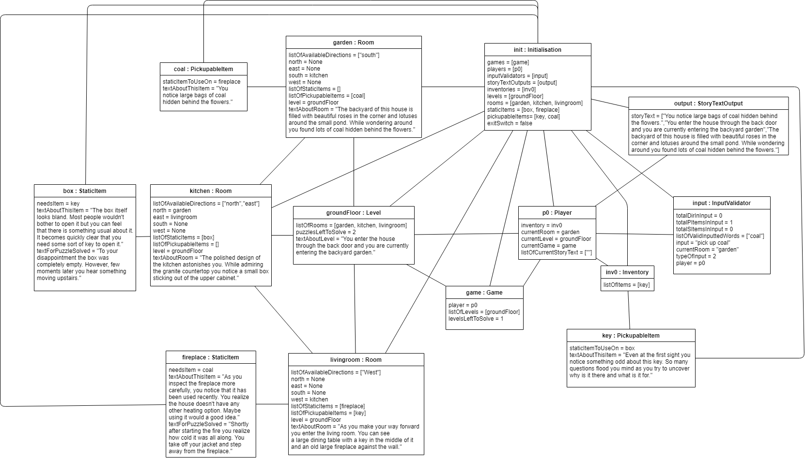

# Assignment 2

Maximum number of words for this document: 12000

**IMPORTANT**: In this assignment you will model the whole system. Within each of your models, you will have a *prescriptive intent* when representing the elements related to the feature you are implementing in this assignment, whereas the rest of the elements are used with a *descriptive intent*. In all your diagrams it is strongly suggested to used different colors for the prescriptive and descriptive parts of your models (this helps you in better reasoning on the level of detail needed in each part of the models and the instructors in knowing how to assess your models).   

**Format**: establish formatting conventions when describing your models in this document. For example, you style the name of each class in bold, whereas the attributes, operations, and associations as underlined text, objects are in italic, etc.
> IN THIS DOCUMENT
>todo: Each class in this document in bold.
>todo: Each attribution, association, operation, with underline.
>todo: Objects (instances)  in italic.

### Implemented feature

| ID  | Short name  | Description  |
|---|---|---|
| F1  | move | Moving player through rooms. |
| F2  | pick up item | Picking up pickupable items in rooms, and placing them in inventory. |
| F3  | "actioning" item | Performing some action on a static item in a room. This completes a puzzle. |
| F4  | use item on item | Use a picked up item in inventory, on a static item in the room. This completes a puzzle.  |
| F5  | inventory | Picked up items are deleted from the room, and added to the inventory. |
| F6  | input validation | User can write any input. Trigger words are directions, names of static items and pickupable items. With the right combination of trigger words, the system processes changes for player's attributes, and updates puzzles solved. |

### Used modeling tool
[draw.io](https://www.draw.io)

## Class diagram									
Author: Ece Doganer

[Class Diagram] (https://github.com/Ece-Doganer/Software-Design/blob/Assignment2/docs/visual/copyOfClassDiagram.jpg)

The following subchapters briefly describe the classes and their attributes, operations, and associations. The prescriptive parts are mentioned within the text, by using "will" and "should". 
All associations are shared aggregation. We went for this design choice as we can construct all instances in one go, through **Initialisation**. Instances still exist, when other instances are deleted. So their creation relies on **Initialisation**, but their existence does not.
All misleading names stated, will be revised. 

####**Initialisation**
This class is a group of methods and attributes which cause the system to be fully initialised, by creating and configuring the needed instances of all other classes, in order to be able to play the game.
- Each attribute is a collection of instances of all classes, used to store and manipulate the instances created.
- An extra attribute is the <u>exitSwitch</u>, which is a boolean, and will be used to exiting the game through the input 'exit'.
- *Initialisation* is a constructor of this class.
- All attributes have a get method. These return the list of items in the according data type.
- All attributes have a set method. These set a list of items of the according data type, to the designated attribute.
- All attributes have a method which initializes the list of instances of its data type. This method returns the list of items of the according data type.
- With the exception of <u>storyTextOutputs</u> and <u>inputValidators</u>, all attributes have a configuration method. This method configures the necessary attributes of the instances of each class type. (Except <u>inputValidators</u> and <u>storyTextOutputs</u>.)
- The **Initialisation** class has a shared aggregation association, where the *initialisation* instance is 1, and all other classes are 1 to unlimited. As this class constructs and updates all other classes, it is a binary association from **Initialisation** class to all other classes.

####Game
This class is meant to be a container of *level* and *player* instances, as well as a class that will deal with the functionality around completing the game. Quick note: we have set <u>player</u> attribute to 1. If we decide on implementing multiplayer, this will become a list of **Player** instances.
- <u>player</u> keeps track of the player in this singleplayer version of the system.
- <u>listOfLevels</u> is a list of at least 1 **Level** instance. We use this to calculate if the game has or hasn't been completed.
- <u>levelsLeftToSolve</u> is an integer, for previously stated calculation.
- <u>setPlayer</u> is a method that needs a **Player** instance, which will be set to the player attribute. 
- <u>setListOfLevels</u> is a method that sets a list of **Level** instances, to make previously stated calculation possible.
- <u>isCompleted</u> is a method returning a boolean. This is where previously stated calculation should happen.
- <u>decreaseLevelsLeftToSolve</u> is a self-explanatory method, which should be called when a **Level** instance is completed.
- There is a shared aggregation association between 1 **Game** instance and 1 to many **Level** instances. It is a binary association, meaning **Game** can call methods of **Level**, but not vice versa. 
- There is a shared aggregation unidirectional association between 1 **Game** instance and 1 **Player** instance.

####Level
This is a class that keeps a collection of **Room** instances. It has an amount of puzzles to solve, in order to finish the **Level** instance, which is needed to finish the game.
- <u>listOfRooms</u> keeps one or many Rooms.
- <u>puzzlesLeftToSolve</u> is an attribute that holds an integer. We keep track of it, in order to be able to calculate when a **Level** instance is completed.
- <u>storyText</u> is a String, which gets a value at the initialisation phase of the system. Every time a user starts a new level, this string should be printed once.
- <u>enterLevel</u> is a boolean, which will will keep track of a level being entered for the first time.
- <u>getListOfRooms</u> retrieves the list of **Room** instances.
- <u>getPuzzlesLeftToSolve</u> returns puzzlesLeftToSolve attribute.
- <u>getTextAboutLevel</u> returns *storyText* attribute.
- <u>addRoomToList</u> is used by **Initialisation** instance to add *rooms* to a *level*.
- <u>decreasePuzzlesLeftToSolve</u> should be used to decrease said attribute.
- <u>isCompleted</u> returns boolean according to having finished a level.
- <u>setListOfRooms</u> needs a list of **Room** instances, and sets this to the *listOfRooms* attribute.
- <u>updatePuzzlesLeftToSolve</u> updates the stated attribute. This should decrease attribute by 1.
- <u>setStoryText</u> needs a string and sets the stated attribute.
- <u>switchEnterLevel</u> is a switch, that causes *enterLevel* to the true only the first time it is checked. The switch will permanently return false after this.
- <u>isCompleted</u> is a boolean returning true if **Level** instance is completed. 
- There is a composition bidirectional association between 1 **Level** instance and 1 or more **Room** instances.
####Room
- <u>listofAvailableDirections</u> is a list of strings that might or might not have elements. One level could consist of one room, hence no directions would be available.
- <u>north</u>, <u>east</u>, <u>south</u>, <u>west</u> all could have one or zero **Room** instances attached.
- <u>listOfStaticItems</u> has one or more instances of **StaticItem** that 'exist' within the room. We need one element to be able to solve the game. (We can "action" it, which is a puzzle solved.)
- <u>listOfPickupableItems</u> has zero or more instances of **PickupableItem** that 'exist' within the room.
- <u>level</u> has the *level* instance which the *room* instance belongs in.
- <u>textAboutRoom</u> is a string that will be printed every time user issues an input. 
- <u>Room</u> is a constructor.
- <u>getListOfAvailableDirections</u> has a list of strings, which could include north east south and/or west.
- <u>getNorth</u>, <u>getSouth</u>, <u>getEast</u>, <u>getWest</u> all return the value of the stated attribute. 
- The set method version of the previously mentioned method, sets a *Room* instance as value to the stated attribute.
- <u>getListOfStaticItems</u> retrieves stated attribute.
- <u>getListOfPickupableItems</u>retrieves stated attribute.
- <u>getTextAboutRoom</u> retrieves *textAboutRoom* attribute.
- <u>setLevel</u> sets *level* attribute with **Level** instance.
- <u>setTextAboutRoom</u> sets stated attribute with string. 
- <u>updateDirections</u> updates **Room** instance of direction attributes.
- <u>updateListOfAvailableDirectionsUsingRooms</u> updates <u>listOfAvaiableDirections</u> by checking if a direction attribute has a value.
- <u>getRoomInDirection</u> gets **Room** instance value of a <u>direction</u> attribute. Needs <u>direction</u>.
- <u>getPickupableItemByName</u> needs a string name, returns item matching name in <u>listOfPickupableItems</u>. 
- <u>getStaticItemByName</u> needs a string name, returns item matching name in <u>listOfStaticItems</u>.
- <u>deletePickupableItemFromList</u> needs **PickupableItem** instance, and deletes it from the <u>listOfPickupableItems</u>.
- <u>deleteStaticItemFromList</u> needs **StaticItem** instance, and deletes it from the <u>listOfPickupableItems</u>.
- <u>addPickupableItemToList</u> needs **PickupableItem** instance, and adds it to the <u>listOfPickupableItems</u>.
- <u>addStaticItemToList</u> needs **StaticItem** instance, and adds it to the <u>listOfPickupableItems</u>.
- There is a composition bidirectional association between 1 **Room** instance and 1 or more **StaticItem** instances. If a **Room** instance is deleted, a <u>static item</u> cannot be accessed anymore.
- There is a composition unidirectional association between 1 **Room** instance and 0 or more **PickupableItem** instances. This association XOR another association (connecting **PickupableItem** and **Inventory**) is valid at any point in time. An instance of **PickupableItem** can only be in an inventory list, or a room list. Also, if a **Room** instance is deleted, a <u>pickupable item</u> cannot be accessed anymore.

####StaticItem
This class deals with an item that is named static, because it is immovable from a room. User cannot pick it up. User can only "action" it, (eg. open door, press button, solve rubics cube), or use a pickup-able item on it (eg. put milk in fridge, use key with lock, give banana to monkey). 
- <u>needsItem</u> has 1 or 0 PickupableItems. If 0, then this StaticItem needs to be "actioned" by user.
- <u>textAboutThisItem</u> is a string: story related text. It will be printed every time a user inputs something, as long as this **StaticItem** instance is not 'solved'. (So not "actioned", or a pickup-able item is not used on it.)
- <u>textForPuzzleSolved</u> is a string of story related text. It will be printed to screen after the user has actioned, or used pickup-able item on it. It shows the user that puzzle is solved. 
- <u>name</u> is a string. Is used to match with input, to find the right instance.
- <u>StaticItem</u> method, is a constructor.
- <u>getNeedsItem</u> returns the <u>needsItem</u> attribute which has a **PickupableItem** value.
- <u>getTextForPuzzleSolved</u> returns <u>textForPuzzleSolved</u> string attribute.
- <u>getName</u> returns <u>name</u> attribute, which is a string.
- <u>setNeedsItem</u> sets a **PickupableItem** instance for the <u>needsItem</u> attribute. This item needs to be used on the current **StaticItem** instance, in order to solve puzzle.
- <u>setTextAboutThisItem</u> sets a string of story text, in the attribute <u>textAboutThisItem</u>.
- <u>setTextForPuzzleSolved</u> sets a string of story text, in the attribute <u>textForPuzzleSolved</u>.
- <u>setName</u> sets string in <u>name</u> attribute.
- <u>isActionable</u> is a boolean that returns true if <u>needsItem</u> has no value. 

####PickupableItem
This class represents pickupable items that a user finds in a **Room** instance, and can pick up. When user types the name of a **PickupableItem** instance that is in the <u>listOfPickupableItems</u> in the **Room** instance of <u>player</u>'s <u>currentRoom</u> attribute, then the **PickupableItem** instance will be deleted from the mentioned **Room** instance's <u>listOfPickupableItems</u>, and will be added to the <u>listOfItems</u> of the **Inventory** instance which is in player's <u>inventory</u> attribute.
**PickupableItem** instances can also be used on a **Static Item** instance: First, user needs to type the name of both the items. Player's <u>currentRoom</u> will need to have the **StaticItem** instance in its list, and that instance would have a <u>needsItem</u> attribute with the same **PickupableItem** instance as in user's input. Then, our solution is to delete the **StaticItem** instance from <u>listOfStaticItems</u> from the <u>currentRoom</u> of player, and delete the **PickupableItem** instance from the <u>inventory</u> of the player. The text for puzzle solved, which is in the **StaticItem** instance that is deleted, will be shown, once. After this, a puzzle will have been solved (thus, puzzle points will be updated).
- <u>StaticItemtoUseOn</u> is an attribute that right now, does not have a function. It is for possible bonus functionality of hints. It holds one **StaticItem** instance, which needs this particular **PickupableItem** instance, to solve a puzzle. Also: All **PickupableItem** instances can be used on a **StaticItem** instance. This last fact might change in a next iteration, for bonus implementations such as food items for health replenishing.
- <u>textAboutThisItem</u> is a string of text, which will be printed when user enters a room. If the item is picked up, this text will not be shown anymore.
- <u>name</u> is a string. It is used for matching with user input.
- <u>textForItemPickedUp</u> Is a string of text, which is printed after a valid pick-up. 
- <u>PickupableItem</u> is a constructor. 
- <u>getName</u> gets string attribute <u>name</u>.
- <u>getTextAboutThisItem</u> gets string attribute <u>textAboutThisItem</u>.
- <u>getTextForItemPickedUp</u> gets string attribute <u>textForItemPickedUp</u>.
- <u>setName</u> sets <u>name</u> string attribute.
- <u>setStaticItemToUseOn</u> sets <u>staticItemToUseOn</u> **StaticItem** instance attribute.
- <u>setTextAboutThisItem</u> sets <u>textAboutThisItem</u> string attribute.
- <u>setTextForItemPickedUp</u> sets <u>textForItemPickedUp</u> string attribute.

####Inventory

An instance of this class is directly connected to a **Player** instance, through its <u>inventory</u> attribute. It holds some **PickupableItems** instances in its <u>listOfItems</u> attribute, that a *player* has picked up from a *room*.
- <u>listOfPickupableItems</u> holds **PickupableItems** instances.
- <u>getItemsInInventory</u> returns <u>listOfPickupableItems</u>.
- <u>getItemByName</u> is a method that checks the name of all **PickupableItem** instances in <u>listOfPickupableItems</u>, and returns the matching item. It is used for input.
- <u>addItemToInventory</u> needs **PickupableItem** instance, adding it to <u>listOfPickupableItems</u>.
- <u>deleteItemFromInventory</u> needs **PickupableItem** instance, deleting it from <u>listOfPickupableItems</u>.
- There is a composition unidirectional association between 1 **Inventory** instance and 0 or more **PickupableItem** instances. This association XOR another association (connecting **PickupableItem** and **Room**) is valid at any point in time. An instance of **PickupableItem** can only be in an inventory list, or a room list.

####Player
This class is designed to hold a collection of attributes that keep track of the user playing the game in multiple ways. The amount of puzzles solved is tracked within **Level** and **Game**. This design makes it possible to (bonus) have multiple players playing and solving the same game, where puzzle points are updated when any player has solved a puzzle.
Note: Our system does not yet handle level and game completing. In a next iteration, we will focus on this.
Note: Some methods print text, when a puzzle is solved. We designed this to be here, instead of **StoryTextOutput**, because it is less complex.
- <u>inventory</u> holds one **Inventory** instance.
- <u>currentRoom</u> holds one **Room** instance.
- <u>currentLevel</u> holds one **Level** instance.
- <u>currentGame</u> holds one **Game** instance.
- <u>setCurrentLevel</u> needs **Level** instance, sets <u>currentLevel</u>.
- <u>setCurrentRoom</u> needs **Room** instance, sets <u>currentRoom</u>.
- <u>setInventory</u> needs **Inventory** instance, sets <u>inventory</u>.
- <u>getCurrentRoom</u> returns <u>currentRoom</u>.
- <u>getInventory</u> returns <u>inventory</u>.
- <u>movePlayer</u> changes <u>currentRoom</u>, according to the valid input that user has issued. The *room* to the input(which is a string) will have been received through a get"direction" method in <u>currentRoom</u>.
- <u>pickUpPickupableItem</u> deletes item from <u>listOfPickupableItems</u> of <u>currentRoom</u>, and adds it to <u>listOfItems</u> in <u>inventory</u>.
- <u>actionStaticItem</u>, is perhaps named misleading: it does not "action" anything. The naming refers to the type of input: "actioning" a static item, will literally mean: delete item from <u>listOfStaticItems</u> of <u>currentRoom</u>. This method also prints the <u>puzzleSolvedText</u> from the *static item*. 
- <u>usePickupableItemOnStaticItem</u>: also misleading name, named after input type. It will check if pickupable item is <u>neededItem</u> for static item. If so, then it will delete pickupable item from <u>listOfItems</u> of <u>inventory</u>, and delete static item from <u>listOfStaticItems</u> of <u>currentRoom</u>.
- <u>checkProgress</u> should run <u>isLevelCompleted</u> and <u>isGameCompleted</u>, which will check the game state from other classes. Eventually, this method will be used to show user a message of a completed level or game, and cause the currentRoom and currentLevel to change. If a <u>currentGame</u> is completed, a message will be shown to user, and input will not be expected anymore.
- <u>isLevelCompleted</u> is a boolean that should return true if <u>puzzlesLeftToSolve</u> in <u>currentLevel</u> is zero. This is a redundant method, we will use <u>currentLevel</u>'s <u>isCompleted</u>, or figure out a different way.
- <u>isGameCompleted</u> is a boolean that should return true if <u>levelsLeftToSolve</u> in <u>currentGame</u> is zero. This is a redundant method, we will use <u>currentGame</u>'s <u>isCompleted</u>, or figure out a different way.
- There is a composition unidirectional association between 1 **Player** instance to 1 **Inventory** instance. 

####StoryTextOutput
This class design is simple: it asks text from level, room, static item and pickupable item instances, according to the <u>currentRoom</u> and <u>currentLevel</u> of the *player*. These can then be printed right before an input is expected.
- <u>storyText</u> (misleading name) is a list of strings, that holds the retrieved text by the "load" methods from this class.
- <u>addLineToStoryText</u> adds a string to <u>storyText</u>.
- <u>printStoryText</u> prints <u>storyText</u>.
- <u>resetStoryText</u> clears <u>storyText</u>.
- <u>loadStoryTextForStartOfLevel</u> (misleading name) retrieves text from <u>currentLevel</u> and <u>currentRoom</u> of *player*, and static items and pickupable items in the lists of <u>currentRoom</u>. 
- <u>loadTextForRoomAndItems</u> (misleading name), same functionality as <u>loadStoryTextForStartOfLevel</u> except it doesn't load <u>currentLevel</u> text.
- There is a composition unidirectional association between 1 **Player** instance to 1 **Inventory** instance. 

####InputValidator
This class validates input and issues resulting methods in *player*. This class does not check if a pickupable item and static item inputted, are the correct combo. This is checked in *player*. This will be revised. 
It is designed for checking only the most important part of the input: the name of pickupable and/or static item. So user can write in different ways, as long as valid item(s) is inputted, it will work.
"Smash milk" would still pick up milk. This is why, when writing puzzle solved story text for milk, it should be specified what user is doing to it.  
- <u>totalDirInInput</u> keeps track in int, how many valid words are directions.
- <u>totalPItemsInInput</u> keeps track in int, how many valid words are pickupable items.
- <u>totalSItemsInInput</u> keeps track in int, how many valid words are static items.
- <u>listOfValidInputtedWords</u> keeps track of all valid words. This is used for <u>isInputAPickupableItemAndStaticItem</u>, which needs two elements.
- <u>input</u>: this attribute is tracked so methods don't have the same parameters in.
- <u>currentRoom</u> this attribute is tracked so methods don't have the same parameters in.
- <u>typeOfInput</u> this is an int, that is used for dividing types of input, in order to <u>passInput</u> to *player* using the right method.
- <u>player</u> this attribute is tracked so methods don't have the same parameters in.
- <u>validateInput</u> this is the main method. It issues the other methods. 
- <u>resetInputHandlerVariables</u> this resets/clears the <u>totalDirInInput</u>, <u>totalPItemsInInput</u>, <u>totalSItemsInInput</u> and <u>listOfValidInputtedWords</u>
- <u>updateInputHandlerVariables</u> this gives value to <u>player</u>, <u>input<u/>, <u>currentRoom<u/>.
- <u>inputParser</u> a 'sentence' of input is parsed into 'words', that are then saved in input.
- <u>wordValidator</u> checks 'words' of a 'sentence' of input, after having parsed it. The next 3 methods (written underneath) are called in this method.
- <u>isWordValidMove</u> checks if word matches with <u>currentRoom</u>'s <u>listOfAvailableDirections</u>. Boolean.
- <u>isWordValidStaticItem</u> checks if word matches with <u>currentRoom</u>'s <u>listOfStaticItems</u>. Boolean.
- <u>isWordValidPickupableItem</u> checks if word matches with <u>currentRoom</u>'s <u>listOfPickupableItems</u>. Boolean.
- <u>inputValidator</u> calls <u>wordValidator</u> and <u>inputTypeValidator</u>.
- <u>isInputADirection</u> checks if the 'total' attributes have the right combination, to be a valid direction. ("north north"=invalid, "north milk"=invalid)
- <u>isInputAPickupableItemAndStaticItem</u> checks if the 'total' attributes have the right combination, to be a valid pair of pickupable and static item.
- <u>isInputAPickupableItem</u> checks if the 'total' attributes have the right combination, to be a valid pickupable item.
- <u>isInputAStaticItem</u> checks if the 'total' attributes have the right combination, to be a valid static item.
- <u>inputTypeValidator</u> changes value of <u>typeOfInput</u> according to the 'totals' attributes.
- <u>orderItems</u> checks <u>listOfValidInputtedWords</u>, and changes order if first item is not pickupable item.
- <u>passInput</u> passes valid words to the right methods in *player*.
- There is a composition unidirectional association between 1 **InputValidator** instance to 1 **Player** instance. 

words: 2928

## Object diagrams								
Author: Mateusz Belka

    

  
The object diagram seen here presents the structure of a specific state of our system through the lens of UML. The aim of this diagram is, as opposed to class diagram, to allow the reader to understand the functional purpose of all classes quickly as well as to see the relationships between classes play out in action. The initial idea behind the structure of relationships between our classes was to maintain a tree-like structure in which the flow of information usually would go through some mediator instead of directly accessing the data from the desired class. Of course, such an approach has limitations as it's at times very troublesome to maintain such structure. Hence, our diagram aims to maintain such structure; however, it someone deviates from it.  
One shall start examining the diagram by noticing the instance of the **initialization** class. It is the most crucial aspect of our diagram since it connected to all other instances of all classes. That is because **initialization** class is responsible for creating instances of all other classes. Outside of initializing, the instance of **game** class is the most integral part of our object structure. The purpose of its existence is to be a container for maintaining information about levels and player. It also allows information flow between those two sides of our tree structure. From the information flow point of view, the instance of the **player** class is the crucial point of the diagram. As we chose **player** class to be responsible for the majority of player-related activities, hence most events overall, most of the method calls either start or end in that class. As a result of our approach, the instance of **player** class also has the most direct accesses to instances of other classes to ease the need to talk to them continually. The instance of the **player** class is most notably connected to its inventories instance, and that object is connected to all of the items currently in it. On the left side from the instance of the **game** class, we can see the entire structure of areas player can reside in as well as the structures that support the existence of those areas. As standard game vocabulary etiquette suggests, we firstly split location into levels, which there can be multiple instances of, however, they are independent, and a player can only have access to one at a time. Each level can be connected to numerous instances of room. Those object of **room** class represents a singular, specific location a player can reside in. Rooms can have a multitude of items, both static items and pickupable items, connected to them or they can have no items. Pickupable items have a unique one-to-one connection with static items which can be seen in the instances of both of those classes on the diagram.

>total words: 471

## State machine diagrams									
Author(s): Valeriya Komarnitskaya, Taylor Doughty 

[ Events and states from the moment a player enters the starting screen until loading the game world.](https://github.com/Ece-Doganer/Software-Design/blob/Assignment2/docs/visual/State%20Machine%20Diagram_final.jpg)
 
State machine diagram represents states and events that are happening from the moment a player enters the starting screen until the actual start of the game. The decision to implement this part of the process in the diagram was made because, in our opinion, it is crucial to show what happens as a very first thing when the player enters the game and through which states do the game go through to load the game. The implementation will be shown in the assignment 3. The state machine diagram consists of 3 parts: the error-free part with input “start new game” or “continue”, the part with error handling and the part with different input than “start new game” or “continue”.

The part without an error is a composite state “Player starts the game” that contains in itself states and events from the moment a player enters the starting screen of the game until a player will load the game world. The game starts from the event when a player enters the starting screen. Then, the terminal is loading a welcoming text that allows a user to understand which options does he/she have before starting the game. The terminal is waiting for the input. The possible options are “start new game”, “continue”, “help”, “quit”. Depending on what user type, the program will analyse the input and do one of the following actions: to start a new game and load the game from the beginning, to continue previously started game, to get some help with the environment and possible inputs or quit the game. In case a user typed something different, the terminal will output a message indicating invalid input and will be waiting for new input. This part will be described in detail later. For now, since we are interested in what is happening when a player chooses to start the game or continue previously started, we proceed to the option when a user is typing “start new game”/”continue”. A quick state in terms of duration is the “load the game”. It is necessary due to the transition between events when a user is typing “start new game”/”continue” and actually starting to load the game. The final state in this composite state is “Start of the game” because this is the final point in loading the game, the moment when a user sees the description of the game, level, room and other story-related information. 

The part that is responsible for error handling is happening when loading the game was unsuccessful in the composite state. In other words, when the game did not load, the terminal outputs an error message and is waiting for new input. It is needed in order to be able to try loading the game by asking the user again to input a command. 

There are currently four possible inputs: “new game”, “continue”, “help”, “exit”. A new game we have already discussed. If a user types something else than “new game”/”continue”, there are three possible outcomes. In order to determine which one is the best for the user’s input, the check has to be completed. If the user has typed “help”, then new information about possible commands and environment will appear and the console will be ready for input again. If a player typed “exit”, then the console will stop waiting for the input and will exit to the desktop. If a user has typed none of these, then a user will receive a message stating that the input is invalid. A terminal will be waiting for new input. In this state machine diagram, in order to implement this check, we decided to use synchronization in order to have multiple options for an input and guards that would actually check the input and proceed to the next step depending on the input. 

>total words: 624

 ####Completing a level
 [Completing a level](https://github.com/Ece-Doganer/Software-Design/blob/Assignment2/docs/visual/StateMachineDiagram_Level.PNG)
 

The second state machine diagram represents the state changes **Level** should go through in the event that a level is completed, once the functionality is implemented. To make it clear, in order for a level to be completed, players must successfully action and use items which then leads to the completion of puzzles, earning themselves puzzle points. Once the target amount of puzzle pieces have been earned, the level is then complete.  

However, the description of the diagram itself is as follows: After the start of the game, the transition containing event "Level is constructed" fires, in which the level is constructed and the class transitions to the Idle state. While in this state, the state waits for commands. Once a command is received, one of the three guards to the transitions leading to Active are checked, then a transition takes place to the Active state. There are three possible transitions: [command: “pick up *PickupAbleItem*” is used], [command: “use *staticItem*” is used], or [other command is used]. It is necessary for one of these three guards to be checked in order for state Active to verify within **Level** if the command is valid.

Once this state is entered, upon entry the state validates if the command is correct. What this means, is that it checks whether the issued command can be successfully completed. After this entry action, if the command was deemed invalid, the guard is immediately checked for transition [command is incorrect], and the class then transitions back to the idle state in which it then waits for a command. However, if the command is valid, the active state performs its activity in which <u>puzzlesLeftToSolve</u> is decreased by 1.

If there are still more than 0 puzzles remaining for the level after <u>puzzlesLeftToSolve</u> has decreased, the guard [<v>puzzlesLeftToSolve</u> > 0] is checked, which  leads the class back to the idle state. But if <u>puzzlesLeftToSolve</u> are then 0, the transition with the guard [<u>puzzlesLeftToSolve</u> = 0] is checked, which leads to Level Completed, which thus marks the end and therefore the completion of the level.
>total words: 357

Maximum number of words for this section: 3000

## Sequence diagrams									
Authors(in sequence): Ece Doganer, Valeriya Komarnitskaya

####User Input Validation

[User Input Validation Diagram](https://github.com/Ece-Doganer/Software-Design/blob/Assignment2/UserInputValidation.jpg)

>Prefix: Main object will already have saved a Player Object, in a variable called player. This will happen in the initialisation phase, which will not be covered now. On to the explanation.

Main object will receive a sentence of string input from user. This input will be sent to object inputValidator for validation. The sequence is as follows:
Inputvalidator will parse the input sentence into words. On these words, a number of functions will be issued. The functions are as follows:
1. First, a word is checked if it is a valid direction. To do this, inputValidator retrieves listOfAvailableDirections from the current room attribute of player. For each direction in this list, inputValidator checks if it equals the word. If so, inputValidator will increase its attribute totalDirectionsInInput, and add the word to its attribute list listOfValidInputtedWords.
2. Second, a word is checked if it is a valid static item. To do this, inputValidator retrieves listOfStaticItems from the current room attribute of player. For each static item in this list, inputValidator checks if it equals the word. If so, inputValidator will increase its attribute totalStaticItemsInInput, and add the word to its attribute list listOfValidInputtedWords.
3. Third, a word is checked if it is a valid pickup-able item. To do this, inputValidator retrieves listOfPickupableItems from the current room attribute of the player. 
A word is also a valid pickup-able item if it exists in player's inventory. Thus, inputValidator also retrieves listOfPickupableItems from player's inventory attribute. 
For each pickup-able item in both of these lists, inputValidator checks if it equals the word. If so, inputValidator will increase its attribute totalPickupableItemsInInput, and add the word to its attribute list listOfValidInputtedWords.

This concludes all functions that check words.

After having checked words, inputValidator checks the combination of the total of valid types of words in a sentence. Explanation is as follows:  
1. If totalDirectionsInInput is 1, and both totalStaticItemsInInput and totalPickupableItemsInInput are 0, then inputValidator's attribute typeOfInput is issued to be 1.
2. If both totalDirectionsInInput and totalStaticItemsInInput are 0, and totalPickupableItemsInInput is 1, then inputValidator's attribute typeOfInput is issued to be 2.
3. If totalDirectionsInInput is 0, totalStaticItemsInInput is 1, and totalPickupableItemsInInput is 0, then inputValidator's attribute typeOfInput is issued to be 3.
4. If totalDirectionsInInput is 0, and both totalStaticItemsInInput and totalPickupableItemsInInput are 1, then inputValidator's attribute typeOfInput is issued to be 4.
5. If there are any other value combinations for totalDirectionsInInput, totalStaticItemsInInput and totalPickupableItemsInInput, then inputValidator's attribute typeOfInput is issued to be 0.  

This concludes validation of the type of the input, which has been validated through looking at the combination of the valid words.

After finding out the value of inputValidator's attribute typeOfInput (and with it, the input sentence's validity), we call the method passInput in inputValidator. This method issues an ensuing method to the player object, depending on the value of typeOfInput. The explanation is as follows:
1. If typeOfInput is 1, movePlayer method is called in the object Player, passing the first and only element in the listOfValidInputtedWords.
2. If typeOfInput is 2, pickUpPickupableItem method is called in the object Player, passing the first and only element in the listOfValidInputtedWords.
3. If typeOfInput is 3, actionStaticItem method is called in the object Player, passing the first and only element in the listOfValidInputtedWords.
4. If typeOfInput is 4, inputValidator first issues a small method, named orderInput. This method checks if the first element of listOfValidInputtedWords is a static item. If so, the first and second element of listOfValidInputtedWords is swapped. Hence the elements are ordered correctly for the next function. InputValidator then calls the actionStaticItem method in the object Player, passing the first and second elements in the listOfValidInputtedWords.

This concludes passing the input to the right method in object Player.

InputValidator has finished: it has parsed the input sentence into words, has compared all the words to the trigger words "north", "east", "south", "west", and names of static and pickup-able items. It has counted the amount of comparisons. Then it has checked the combinations of those valid comparisons, and has issued the right method according to those combinations.
Quick note: InputValidator checks only if input would be a valid statement. InputValidator does not check logical content, for example, if a pickup-able item is the right item to be used on a static item. For now, this happens elsewhere. The reasoning is that the class would get more complex, especially when further bonus features would be implemented. We might congregate or deal with this in another way, in a next iteration.
This concludes the description of User Input Validation.

>total words: 760

####Movement Diagram
[Movement diagram](https://github.com/Ece-Doganer/Software-Design/blob/Assignment2/docs/visual/Sequence%20Diagram_final.jpg)

Sequence Diagram represents states and events that are arranged in time sequence. The following sequence diagram describes processes from the moment a player enters the direction he/she wants to move in till the moment when the message about the successful movement and item list will appear on the screen. 

The process starts with the user typing the input to the terminal. For movement, there are two possible inputs in four directions: move [in direction: North/South/East/West] or [direction:North/South/East/West]. We implemented it this way, so a player will have a smaller chance of getting an input error and a higher chance to parse the input. This makes our game more user-friendly and allows a player to choose the most convenient option. After that, the inputted command is passed to the class **InputValidator**. **InputValidator** class has three responsibilities. First is checking the input: if the input is valid, parsing the input and checking if the direction is valid in terms of spelling. Second, in order to understand if a player can move in a certain direction, we need to take into account the configuration of rooms. Depending on the room you are in, it is important to request a list of available directions from the **Room** class and check if the inputted direction is within the list. There are two scenarios: the direction is in the list and the direction is not in the list. That is why we have an if-else statement: if our direction is not in the list, that means that it is not possible to move in the direction and we return a message about the input and list again of items in the room. Else, if the inputted direction is in the list of the available directions, then the third responsibility of the class **InputValidator** is to increase the total number of directions in input and add player’s inputted valid direction to the list of valid inputted words. The next step is passing the input to the class **Player** and assigning 1 to the type of input, indicating that the operation is related to movement. We call <u>getRoomInDirection(direction)</u> in order to get the information about the room we are accessing. Finally, we are assigning the variable "current room" to the room we have entered right now and returning to the user all the information about the room and items inside the room. It is important to notice that right after a user will receive text, a terminal is immediately ready for the new input. It happens because the main function contains a loop that outputs certain text and is waiting for input every time an action happens. This way, it always is informing the user about success or failure.
>total words: 451

Maximum number of words for this section: 3000

## Implementation									
Author: Mateusz Belka

From the very beginning, the overarching mentality when constructing the skeleton of our project was to implement it in such a way that it would be easily expandable. That means both from the perspective of infinitely complex story as well as adding code for additional features or expanding on existing features without redesigning existing implementation. We started following such an approach since we began work on our first UML diagram, and it followed through to when we executed those ideas in Java. With that in mind, we quickly realized the crucial part of our implementation was to have an independent, easily expandable class system. In order to achieve this, we chose to focus on coming up with small classes which contain many but straightforward methods and a manageable number of attributes.  
We believed this approach to be pivotal as we quickly realized while working on a class diagram that there is only so much that we can implement on paper. The more complex our diagram is before we start implementation, the more prone we are to accidentally disregard or bypass individual element needed for our system to function adequately. As such, we had to begin our implementation with the idea of updating our diagrams along the way. At first, we started with creating skeleton classes for all of the classes as they were described in our class diagram. In the scenario when a method would require a function call from another class which has not yet been implemented, we commented that part out and revisited it at a later time. In our initial version of the class diagram, we didn't have a method of constructing our story, i.e. initializing our classes with story-dependent information such as item names or room configurations.  
The first major stopping point, which required unique solution, arose amid creation of initialization class. The critical objective we had to keep in mind while designing initialization class was that our goal in the final version of our project was to remove all possible hardcoding on story elements. As such the user would be capable of creating the entire story through in-game means and we wanted to initial version of initialization class no to hinder our ability to accomplish that in the future while at the same time providing temporary solution of a hardcoded storyline. The critical aspect of our deployed version of initialization class is to firstly initialize all instances of classes and afterwards to populate their attributes. We aim to provide the functionality of creating your own story through the redesign of the above-mentioned methods at a later point in development. From the expandability standpoint, the significant milestone we managed to reach was to develop our system such that we can pinpoint the exact location of methods that need to be updated to provide new functionality without implementing changes to any other aspect of the system. The second unique issue we had to resolve regards processing user input and system output. The initial dispute was over the location of those classes in our class diagram. Should they be part of an existing class, a child class or be a class on their own? As there is no definitive, correct answer here, we believe that it makes the most sense to allow those classes to operate by themselves. Their main line of communication is through the player as we believe all of the possible user input is player-driven and further method calls should originate from the player class as it is the player making a choice (input handling) or receiving results of their actions (output handling).  
The location of the **main** Java class needed for executing our system is "\src\main\java\Main.java". This class is responsible for the initial call to initialization class as well as the main game loop responsible for listening for user input and presenting the user with output. The jar executable file can be found at "\out\artifacts\software_design_vu_2020_jar\software-design-vu-2020.jar".

Click image to watch 30 seconds video of our game!

>total words: 651

## References

References, if needed.
